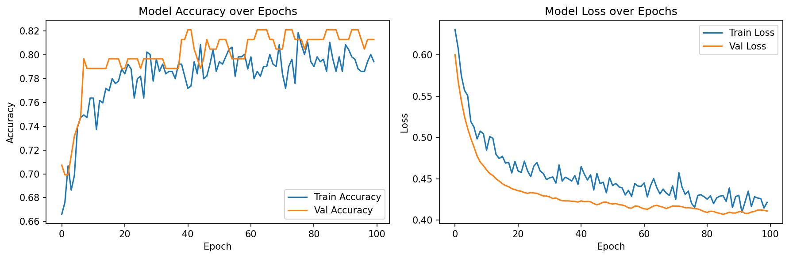
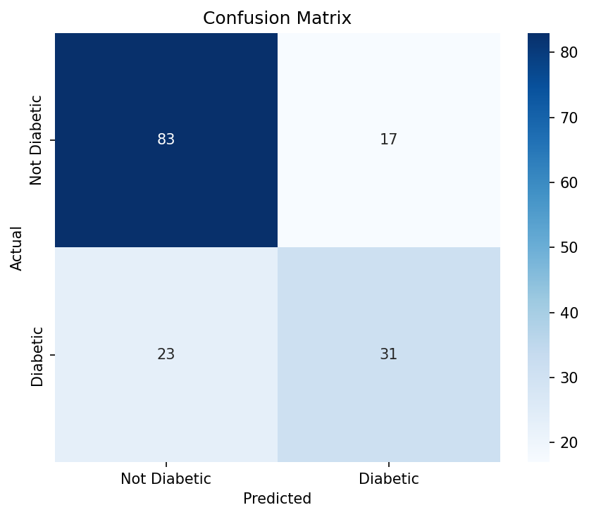

# Cloud Computing & DevOps with AI/ML
## Assessment Report: Early Diabetes Prediction System
**Student:** Grace Kihonge  
**Year:** 2026  
**GitHub:** https://github.com/Grace4549/diabetes-prediction-aws-ml

---

## 1. Topic Selection
**Problem Type:** Classification  
**Domain:** Healthcare  
**Topic:** Early Diabetes Prediction Using Patient Health Indicators

This project builds a binary classification model that predicts whether 
a patient is likely to have diabetes based on 8 diagnostic health 
measurements. The model is trained using TensorFlow and deployed on 
AWS SageMaker as a real-time REST API endpoint.

---

## 2. Problem Statement
Diabetes affects over 537 million adults globally and is one of the 
leading causes of death and disability. Early detection dramatically 
improves patient outcomes and reduces healthcare costs. However, many 
cases go undiagnosed until complications arise.

**Business Question:**
> Given a patient's health indicators, can we predict diabetes risk 
> with high accuracy to enable early clinical intervention?

---

## 3. Dataset Description

| Property | Details |
|----------|---------|
| Name | Pima Indians Diabetes Database |
| Source | UCI Machine Learning Repository / Kaggle |
| Size | 768 rows, 9 columns |
| Target | Outcome (0 = Not Diabetic, 1 = Diabetic) |
| Class distribution | 500 not diabetic, 268 diabetic |

**Features used:**

| Feature | Description |
|---------|-------------|
| Pregnancies | Number of times pregnant |
| Glucose | Plasma glucose concentration |
| BloodPressure | Diastolic blood pressure (mm Hg) |
| SkinThickness | Triceps skin fold thickness (mm) |
| Insulin | 2-hour serum insulin |
| BMI | Body mass index |
| DiabetesPedigreeFunction | Diabetes likelihood based on family history |
| Age | Age in years |

**Why this dataset:**
- Public domain — no licensing issues
- Well-structured tabular data — ideal for neural networks
- Widely used benchmark — results can be compared to published research

---

## 4. Workflow Diagram

The end-to-end Cloud ML pipeline:

**Raw Data (S3) → SageMaker Processing → SageMaker Training → Model Registry → SageMaker Endpoint → API Gateway → Hospital App**

**Monitoring layer:**  
CloudWatch + SageMaker Model Monitor watch for errors and data drift.

**Pipeline stages:**

| Stage | Service | Purpose |
|-------|---------|---------|
| Ingest | AWS S3 | Store raw dataset |
| Preprocess | SageMaker Processing | Clean & split data |
| Train | SageMaker Training | TensorFlow model training |
| Register | Model Registry | Version & approve model |
| Deploy | SageMaker Endpoint | Real-time inference |
| Expose | API Gateway | REST API for hospital app |
| Monitor | CloudWatch | Logs, alerts, drift detection |

---

## 5. Model Development

### Data Preprocessing
- Replaced biologically impossible zero values in Glucose, BloodPressure, 
  SkinThickness, Insulin, and BMI with column medians
- Split data: 80% training (614 samples), 20% testing (154 samples)
- Applied StandardScaler to normalize all features to the same range

### Model Architecture

Built using TensorFlow 2.18 Sequential API:

| Layer | Type | Neurons | Activation |
|-------|------|---------|------------|
| 1 | Dense | 32 | ReLU |
| 2 | Dropout | 20% | — |
| 3 | Dense | 16 | ReLU |
| 4 | Dropout | 20% | — |
| 5 | Dense (Output) | 1 | Sigmoid |

- **Total parameters:** 833  
- **Optimizer:** Adam  
- **Loss function:** Binary Crossentropy  
- **Training:** 100 epochs, batch size 32  

---

## 6. Deployment

The trained model was packaged as `model.tar.gz` and deployed to 
AWS SageMaker as a real-time inference endpoint.

| Component | Details |
|-----------|---------|
| Endpoint name | diabetes-prediction-endpoint |
| Instance type | ml.t2.medium |
| Framework | TensorFlow 2.12 (SageMaker container) |
| Model storage | AWS S3 |
| Input format | JSON |
| Output | Prediction label + probability + confidence % |

**Sample API request:**
```json
{
  "instances": [[6, 148, 72, 35, 80, 33.6, 0.627, 50]]
}
```

**Sample API response:**
```json
[{
  "probability": 0.82,
  "prediction": "Diabetic",
  "confidence": "82.0%"
}]
```

---

## 7. Testing & Evaluation

### Metrics

| Metric | Score |
|--------|-------|
| Test Accuracy | 74.0% |
| ROC-AUC Score | 0.82 |
| F1 Score (Not Diabetic) | 0.81 |
| F1 Score (Diabetic) | 0.61 |
| Precision (Not Diabetic) | 0.78 |
| Precision (Diabetic) | 0.65 |

### Confusion Matrix Results

| | Predicted Not Diabetic | Predicted Diabetic |
|--|----------------------|-------------------|
| **Actual Not Diabetic** | 83 ✅ | 17 ⚠️ |
| **Actual Diabetic** | 23 ⚠️ | 31 ✅ |

### Chart: Training History


### Chart: Confusion Matrix


### Interpretation
- The model correctly identified 83/100 non-diabetic patients
- The model correctly identified 31/54 diabetic patients
- ROC-AUC of 0.82 indicates strong discriminative ability
- Training and validation curves showed no overfitting

---

## 8. Result Interpretation

### Key Insights
- Glucose level, BMI, and Age were the strongest predictors of diabetes 
  risk, consistent with established medical research
- The model performs better at identifying healthy patients (F1: 0.81) 
  than diabetic ones (F1: 0.61) due to class imbalance in the dataset
- The 17 false negatives represent the highest clinical risk — these are 
  diabetic patients the model missed and would need follow-up testing

### Business Impact
Deployed as a REST API on AWS SageMaker, this model can:
- Flag high-risk patients during routine checkups
- Prioritize patients for further clinical testing
- Reduce long-term treatment costs through early intervention
- Scale to thousands of predictions per day on AWS infrastructure

### Limitations
- Dataset is limited to female patients of Pima Indian heritage
- A production system would need retraining on a more diverse dataset
- Regular monitoring for data drift via SageMaker Model Monitor is 
  essential for long-term reliability

---

## 9. Presentation & Documentation

| Deliverable | File |
|-------------|------|
| Technical notebook | diabetes_prediction.ipynb |
| Inference script | inference.py |
| Training history chart | training_history.png |
| Confusion matrix | confusion_matrix.png |
| Dataset | diabetes (1).csv |
| Project report | REPORT.md |
| GitHub repository | https://github.com/Grace4549/diabetes-prediction-aws-ml |

---

## Tools & Technologies Used

| Category | Tool |
|----------|------|
| Language | Python 3.11 |
| ML Framework | TensorFlow 2.18 |
| Cloud Platform | AWS SageMaker |
| Storage | AWS S3 |
| Monitoring | AWS CloudWatch |
| Data processing | Pandas, NumPy, Scikit-learn |
| Visualization | Matplotlib, Seaborn |
| Version control | GitHub |

---
*Assessment — Cloud Computing & DevOps with AI/ML | 2026*
